# สถาปัตยกรรม (Architecture)

## โซลูชันและโปรเจกต์

> **อัปเดต (Phase 1 ของ [`ROADMAP.md`](./ROADMAP.md)):** เพิ่มโปรเจกต์ `Core` และ `Tests/LockscreenGif.Core.Tests` เข้ามาในโซลูชัน เพื่อเริ่มแยก business logic ที่ทดสอบได้ออกจาก WinUI/WinRT

`LockscreenGif.sln` ประกอบด้วย 4 โปรเจกต์:

| โปรเจกต์ | ประเภท | หน้าที่ |
| --- | --- | --- |
| `LockScreenGif` | WinUI 3 Desktop App (`net9.0-windows10.0.26100.0`, x64) | แอปหลักที่ผู้ใช้เห็นและโต้ตอบด้วย |
| `Core` | Class Library (`net9.0`... ปัจจุบันตั้งเป็น `net8.0`, ดูหมายเหตุด้านล่าง) | Logic ล้วน ๆ ที่ไม่มี dependency กับ WinUI/WinRT — คำนวณ/parse/format ที่ทดสอบได้ (ดู [`SERVICES.md`](./SERVICES.md#core)) |
| `Logger` | Class Library | Logging แบบ static (เขียนไฟล์ log) + สร้าง crash dump (`MiniDumpWriteDump`) ใช้ร่วมกันในโปรเจกต์หลัก |
| `Tests/LockscreenGif.Core.Tests` | xUnit Test Project | Unit test สำหรับ `Core` |

`LockScreenGif` อ้างอิง `Logger` และ `Core` ผ่าน `ProjectReference` (ดู `LockscreenGif.csproj`) `Core.Tests` อ้างอิงเฉพาะ `Core`

> **หมายเหตุเรื่อง TargetFramework:** `Core`/`Core.Tests` ตั้งเป็น `net8.0` (LTS, ไม่มี Windows-specific dependency) แทนที่จะตาม `net9.0-windows10.0.26100.0` ของแอปหลัก เพราะ `Core` เป็น pure C# ไม่จำเป็นต้องพึ่ง Windows App SDK เลย และการอ้างอิงจากโปรเจกต์ net9.0-windows ไปยัง library net8.0 เป็นเรื่องปกติ ไม่มีปัญหา compatibility

## รูปแบบที่ใช้: MVVM + Generic Host DI

โปรเจกต์นี้สร้างจาก Template Studio (ดู `TemplateStudio.xml`) โดยใช้โครงสร้างมาตรฐานของ WinUI 3 MVVM Toolkit template:

- **View** (`Views/MainPage.xaml` + code-behind) — หน้าจอเดียวของแอป (single-page app)
- **ViewModel** (`ViewModels/MainViewModel.cs`) — ปัจจุบันแทบไม่มี logic (ตรรกะหลักส่วนใหญ่อยู่ใน code-behind ของ `MainPage.xaml.cs` แทน)
- **Services / Contracts** — บริการต่าง ๆ ถูกกำหนด interface ไว้ใน `Contracts/Services` และมี implementation จริงใน `Services/`
- **Activation** — ชุด handler สำหรับกระบวนการ activate/launch แอป (`Activation/`)

### การประกอบ Dependency Injection (`App.xaml.cs`)

แอปสร้าง `IHost` จาก `Microsoft.Extensions.Hosting` ตอนสตาร์ทแอป และลงทะเบียน services ดังนี้:

```mermaid
flowchart TD
    Host[Generic Host] --> AH1[ActivationHandler&lt;LaunchActivatedEventArgs&gt;\nDefaultActivationHandler]
    Host --> AH2[IActivationHandler\nAppNotificationActivationHandler]
    Host --> S1[IAppNotificationService\nAppNotificationService]
    Host --> S2[IThemeSelectorService\nThemeSelectorService]
    Host --> S3[IActivationService\nActivationService]
    Host --> S4[IPageService\nPageService]
    Host --> S5[INavigationService\nNavigationService]
    Host --> S6[ILockscreenService\nLockscreenService]
    Host --> S7[IDisplayService\nDisplayService]
    Host --> S8[IFfmpegService\nFfmpegService]
    Host --> S9[IGifSkiService\nGifSkiService]
    Host --> VM[MainViewModel]
    Host --> View[MainPage]
```

> จนถึง Phase 1, `DisplayService`/`FfmpegService`/`GifSkiService` เป็น static class ทั้งหมด — ตอนนี้ถูกแปลงเป็น interface + instance service ที่ลงทะเบียนผ่าน DI แล้ว (`IDisplayService`, `IFfmpegService`, `IGifSkiService`) เพื่อให้ mock/ทดสอบได้

Services ถูกเข้าถึงผ่าน static helper `App.GetService<T>()` ซึ่งจะโยน exception ถ้ายังไม่ได้ลงทะเบียนไว้

การ activate แอปเริ่มที่ `App.OnLaunched` → `IActivationService.ActivateAsync()` → ตั้งค่า theme, สร้าง shell (`Frame`), หา `IActivationHandler` ที่ handle ได้ (fallback เป็น `DefaultActivationHandler` ซึ่งจะ navigate ไปหน้า `MainPage`)

### การจัดการ Configuration

`appsettings.json` ถูกโหลดเข้า Generic Host โดยอัตโนมัติ และ bind เข้ากับ `LocalSettingsOptions` (`Models/LocalSettingsOptions.cs`) ผ่าน `services.Configure<LocalSettingsOptions>(...)`

### การจัดการข้อผิดพลาดระดับแอป (Global exception handling)

ใน `App()` constructor มีการ hook 3 จุด:

- `UnhandledException` (WinUI UI thread)
- `AppDomain.CurrentDomain.UnhandledException`
- `TaskScheduler.UnobservedTaskException`

ทั้งหมดเรียก `HandleCrash()` ซึ่งจะ:
1. สร้างไฟล์ crash dump ผ่าน `DumpCreator.MiniDumpWriteDump` (โปรเจกต์ `Logger`)
2. Log ข้อผิดพลาดระดับ `Fatal` ผ่าน `Logger`
3. แสดง native `MessageBox` (เพราะ WinUI ไม่มี `MessageBox.Show` ในตัว)
4. ปิดแอปด้วย `Environment.Exit(1)`

## โครงสร้างโฟลเดอร์ของ `LockScreenGif`

| โฟลเดอร์ | เนื้อหา |
| --- | --- |
| `Activation/` | Handler สำหรับ activation events (launch ปกติ, toast notification activation) |
| `Assets/` | ไอคอน, โลโก้, splash screen ของแอป |
| `Contracts/Services`, `Contracts/ViewModels` | Interface ของ services/viewmodels |
| `CustomControls/` | `CustomRangeSelector` — ขยาย `RangeSelector` ของ Community Toolkit ให้ยิง event ระหว่างลาก thumb แบบ real-time (ใช้เลือกช่วงเวลาตัดวิดีโอ) |
| `Helpers/` | Extension methods (โหลด resource string ที่ localize แล้ว, ตรวจ runtime แบบ packaged/unpackaged, จัดการสี title bar) |
| `Models/` | POCO models เช่น `LocalSettingsOptions` |
| `Services/` | Business logic หลักทั้งหมด (ดู [`SERVICES.md`](./SERVICES.md)) |
| `Styles/` | Resource dictionary สำหรับสไตล์ XAML |
| `Vendor/FFMPEG`, `Vendor/gifski` | ไบนารีภายนอกที่ bundle มากับแอป (`ffmpeg.exe`, `gifski.dll`) |
| `ViewModels/` | `MainViewModel` |
| `Views/` | `MainPage.xaml` (+ code-behind) — UI หลักทั้งหมดของแอป |

## แนวคิดสำคัญที่ควรรู้ก่อนแก้โค้ด

- **Logic ส่วนใหญ่ยังอยู่ใน code-behind ไม่ใช่ ViewModel** — `MainPage.xaml.cs` ยังเป็นไฟล์ที่ค่อนข้างใหญ่และรับผิดชอบ state/orchestration ส่วนใหญ่ (ควบคุม preview วิดีโอ, เรียก FFmpeg/Gifski, เรียก LockscreenService) — **logic ล้วน ๆ ที่ไม่ต้องพึ่ง XAML controls ถูกดึงออกไปอยู่ใน `Core` แล้ว (ดู Phase 1 ใน [`ROADMAP.md`](./ROADMAP.md))** ส่วนการย้าย state/command ที่เหลือเข้า `MainViewModel` ยังเป็นงานค้าง
- **การเขียนไฟล์ระบบต้องใช้สิทธิ์ผู้ดูแลระบบ (elevated)** — `LockscreenService` เรียก `takeown`/`icacls` ผ่าน `Process.Start` ด้วย `Verb = "runas"` ซึ่งจะเด้ง UAC prompt ทุกครั้งที่ apply/remove lockscreen
- **ไฟล์ชั่วคราวทั้งหมดอยู่ใต้ `%LocalAppData%\LockscreenGif\Temp`** จัดการผ่าน `TempDirectoryService`, `FfmpegService`, `GifSkiService` และจะถูกล้างทั้งตอนเริ่มแอป (`App()`) และหลัง generate เสร็จ (`finally` block ใน `GenerateButton_Click`)
- **`FfmpegService`/`GifSkiService`/`DisplayService` เป็น instance service ที่ลงทะเบียนผ่าน DI แล้ว** (ไม่ใช่ static class อีกต่อไป) — เรียกผ่าน interface `IFfmpegService`/`IGifSkiService`/`IDisplayService` เสมอ เพื่อให้ mock/ทดสอบได้
