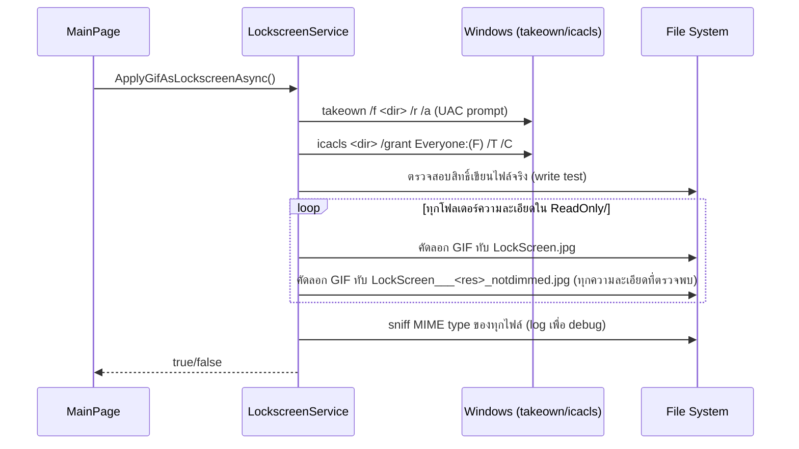
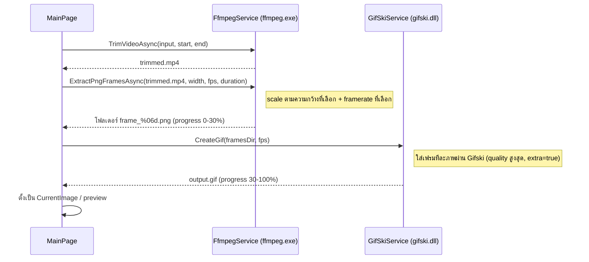

# กลไกการทำงาน (How It Works)

เอกสารนี้อธิบาย 2 กลไกหลักของแอป:

1. วิธีที่แอปหลอกให้ Windows ใช้ GIF เป็นภาพหน้าจอล็อก
2. ไปป์ไลน์การแปลงวิดีโอเป็นไฟล์ GIF คุณภาพสูง

---

## 1) การปลอมภาพหน้าจอล็อก (`LockscreenService`)

ปกติ Windows จะ cache ภาพหน้าจอล็อกที่ผู้ใช้เลือกไว้ในโฟลเดอร์ระบบ:

```
C:\ProgramData\Microsoft\Windows\SystemData\<UserSID>\ReadOnly\
```

ภายในโฟลเดอร์นี้จะมีโฟลเดอร์ย่อยหลายอัน (แยกตามความละเอียดหน้าจอ) แต่ละอันมีไฟล์ที่ Windows ใช้แสดงผล เช่น `LockScreen.jpg` และไฟล์แบบ "dimmed" (หรี่แสง ใช้ตอนจอถูกล็อกและไม่มีการโต้ตอบ) ชื่อไฟล์รูปแบบ `LockScreen___<width>_<height>_notdimmed.jpg`

**Windows จะแสดงไฟล์เหล่านี้ตาม _เนื้อหาไบต์จริง_ ของไฟล์ ไม่ได้ตรวจสอบจากนามสกุลไฟล์อย่างเข้มงวด** — ดังนั้นหากเราคัดลอกไฟล์ GIF จริง (bytes เป็น GIF89a) ไปทับไฟล์ `.jpg` เหล่านี้ Windows ก็ยังคงแสดงผลเป็นภาพเคลื่อนไหวได้ตามปกติ นี่คือแก่นของกลไกทั้งหมด

### ขั้นตอนที่ `LockscreenService.ApplyGifAsLockscreenAsync()` ทำ



รายละเอียดเพิ่มเติม:

- **`TryGetLockScreenMode()`** อ่านค่าจาก Registry (`HKCU\...\Lock Screen\Creative` และ `...\Lock Screen`) เพื่อเดาว่าผู้ใช้กำลังใช้โหมด Spotlight, Slideshow หรือ Picture/Other อยู่ — ใช้แสดงคำเตือนใน UI เท่านั้น (ถ้าเป็น Spotlight/Slideshow อาจไม่เห็นผลจนกว่าจะเปลี่ยนกลับเป็น Picture)
- **`GetDimmedDestFileNames()`** รวมชื่อไฟล์ปลายทางจาก 2 แหล่ง: (1) คำนวณจากความละเอียดจอที่ต่อกับเครื่องจริง (`DisplayService.GetDisplayResolutions()` ผ่าน `WindowsDisplayAPI`) และ (2) ไฟล์ `_notdimmed.jpg` ที่มีอยู่แล้วในโฟลเดอร์ปลายทาง (เผื่อกรณีความละเอียด/ off-by-one ที่คำนวณเองไม่ตรง)
- ถ้าการคัดลอกไฟล์ล้มเหลว (permission ไม่พอแม้ takeown ไปแล้ว) จะพยายาม `GrantFullControlOnFileAsync()` แบบ per-file ก่อน retry อีกครั้ง
- ฟังก์ชัน `DetectMimeType()` ใช้ `urlmon.dll` (`FindMimeFromData`) เพื่อ sniff MIME จริงของไฟล์ที่เขียนไป แล้ว log ไว้เป็นข้อมูล debug (ไม่ ได้ ใช้ตัดสินใจ logic ใด ๆ)

### การลบ GIF ที่ตั้งไว้ (`RemoveAppliedGif`)

ลบไฟล์ `*_notdimmed.jpg` ทั้งหมดที่เจอในทุกโฟลเดอร์ย่อยของ `ReadOnly/` (ปล่อยให้ Windows สร้างไฟล์เหล่านี้ใหม่เองจากภาพหน้าจอล็อกปกติในครั้งถัดไป)

> **หมายเหตุด้านความปลอดภัย/ความเสี่ยง:** ฟีเจอร์นี้เขียนทับไฟล์ในโฟลเดอร์ระบบ `C:\ProgramData\...\SystemData` และต้องเปลี่ยนสิทธิ์ (ownership/ACL) ของโฟลเดอร์นั้นแบบถาวร ผู้ใช้ควรเข้าใจว่านี่คือการแก้ไขระดับระบบ ไม่ใช่แค่ตั้งค่าแอปทั่วไป

---

## 2) ไปป์ไลน์แปลงวิดีโอเป็น GIF (`FfmpegService` + `GifSkiService`)

เนื่องจาก **รองรับเฉพาะไฟล์ `.gif` จริงเท่านั้น** (ตามที่ระบุใน `README.md` หลัก) หากผู้ใช้ต้องการใช้วิดีโอ แอปจะแปลงวิดีโอเป็น GIF ให้อัตโนมัติผ่านไปป์ไลน์นี้ (เริ่มที่ `MainPage.GenerateButton_Click`):



ขั้นตอนโดยละเอียด:

1. **Trim** — `FfmpegService.TrimVideoAsync()` ตัดวิดีโอตามช่วงเวลาที่ผู้ใช้เลือกด้วย `CustomRangeSelector` (drag เลือก start/end บน timeline)
2. **Extract frames** — `FfmpegService.ExtractPngFramesAsync()` scale วิดีโอตามความกว้างที่เลือก (คง aspect ratio ด้วย `Scale(width, -2)`) แล้วแยกเป็นชุดภาพ PNG ตาม framerate ที่เลือก
3. **Encode GIF** — `GifSkiService.CreateGif()` เรียงเฟรมตามลำดับตัวเลขในชื่อไฟล์ แล้วป้อนเข้า Gifski ทีละเฟรมพร้อม timestamp ที่คำนวณจาก framerate เพื่อเข้ารหัสเป็น GIF คุณภาพสูง (คล้ายวิดีโอ ไม่ใช่ GIF คุณภาพต่ำแบบดั้งเดิม)
4. ไฟล์ GIF ผลลัพธ์ถูกโหลดเป็น `StorageFile` และตั้งเป็น `ILockscreenService.CurrentImage` พร้อม preview ทันทีใน UI — ผู้ใช้กด "Set Lockscreen" เพื่อรันขั้นตอนในหัวข้อ (1) ต่อ

ทั้งสอง service เก็บไฟล์ชั่วคราวไว้ใต้ `%LocalAppData%\LockscreenGif\Temp\{ffmpeg_temp_*, gifski_temp_*}` และมีการล้าง (`CleanupTempDirectories`) ทั้งตอนเริ่มแอปและหลัง generate เสร็จในทุกกรณี (`finally`)

### ตัวอย่างการควบคุมความกว้าง/FPS

`MainPage` มี dropdown ให้เลือกความละเอียด (`ComboResolution`) และ FPS (`ComboFps`) ซึ่งมีการเตือนขนาดไฟล์โดยประมาณผ่าน `UpdateFileSizeWarning()` เมื่อผู้ใช้เลือกค่าที่อาจทำให้ไฟล์ GIF ใหญ่เกินไป
